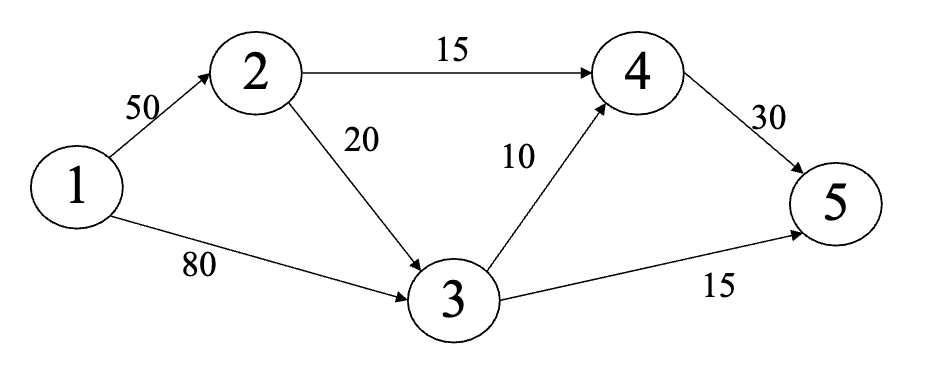

# Dijkstra Algorithm in C

## 概要

C言語でダイクストラ法を実装したプログラムです。

グラフを隣接リストで管理し、優先度付きキューとして最小ヒープ(Binary Heap)を実装しています。

大学の授業にてアルゴリズム・データ構造の学習の一環として作成しました。

## ファイル構成

- main1.c : メイン処理
- heap1.h : 構造体・関数宣言
- heap1.c : ヒープおよびダイクストラ法の実装

## 実行方法

```bash
gcc main1.c heap1.c -o dijkstra
./dijkstra
```
## 入出力の形式
### 入力
次のように順に入力していきます。
1. 頂点数 `n`
2. 辺数 `m`
3. 各頂点について
   - 「接続先頂点番号」「辺の重み」を入力
   - `-1` を入力するとその頂点の辺入力を終了
### 出力
頂点1から各頂点までの最短距離を一行ごとに出力

### 例
下図のような有向グラフ以下のように入力します。


```
5 7
2 50 3 80 -1
3 20 4 15 -1
4 10 5 15 -1
5 30 -1
-1
```
これに対し、
```
1 0.000000
2 50.000000
3 70.000000
4 65.000000
5 85.000000
```
という出力をするコードとなります。

